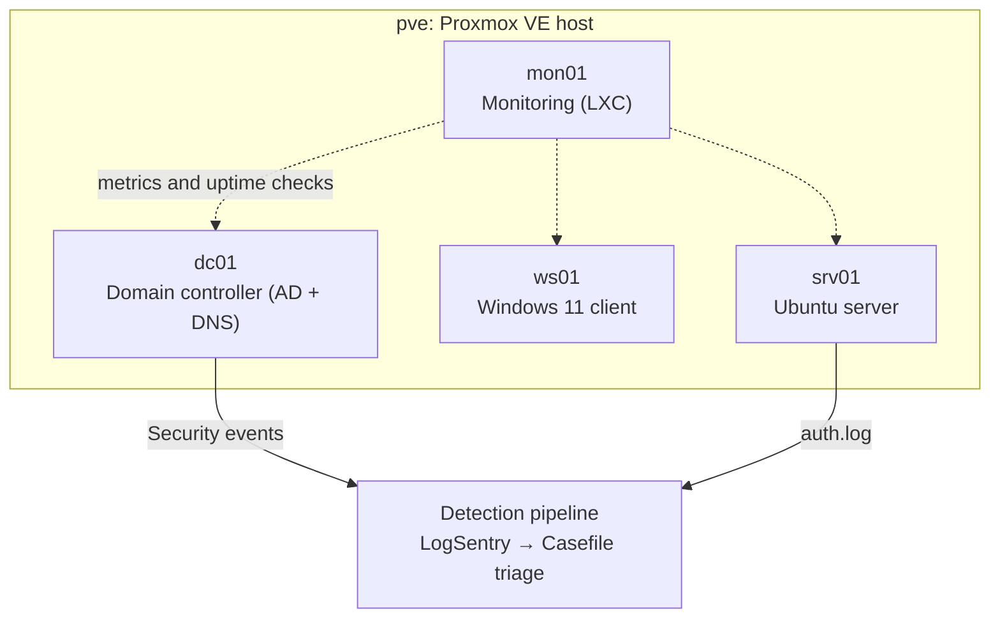

# ThinkCentre Homelab

A Proxmox home lab running on a single refurbished Lenovo ThinkCentre (16 GB RAM): a Windows Active Directory domain, a Windows 11 client, an Ubuntu server, and a monitoring node, all on one machine.

## Writeups

### [Security lab →](security-lab.md)
An Active Directory domain with an advanced audit policy, a log-detection pipeline that turned about 1,960 Windows security events into 40 grounded triage notes, and a Linux server hardened from **71% (grade D) to 95% (grade A)** against a CIS-style baseline.

### [Monitoring stack →](monitoring.md)
Prometheus, Grafana, Alertmanager and Uptime Kuma watching all five hosts: 15 scrape targets, 8 alert rules, 9 uptime checks and a status page, with alerting proven by controlled outages on a Linux and a Windows host.

## The lab

| Host | Role | OS |
| --- | --- | --- |
| pve | Proxmox VE hypervisor | Proxmox VE 9 (Debian) |
| dc01 | Domain controller (AD DS + DNS) | Windows Server 2025 |
| ws01 | Domain-joined client | Windows 11 Enterprise |
| srv01 | Linux server, hardening target | Ubuntu Server 24.04 LTS |
| mon01 | Monitoring node (LXC) | Debian 13 |

## Stack

`Proxmox VE` · `Windows Server 2025` · `Active Directory` · `Group Policy` · `Ubuntu` · `auditd` · `ufw` · `Prometheus` · `Grafana` · `Alertmanager` · `Uptime Kuma`
