# Infrastructure Monitoring & Alerting Stack

[← Back to the lab overview](README.md) · [Security lab writeup](security-lab.md)

A self-hosted monitoring stack for a Proxmox home lab that runs a Windows
Active Directory domain and Linux servers. **Prometheus** collects metrics,
**Grafana** shows them, **Alertmanager** routes alerts, and **Uptime Kuma**
runs independent service checks and a status page.

**Status:** built, verified and in daily use. All 15 Prometheus scrape targets
are up, all 7 blackbox service probes pass, and all 9 Uptime Kuma monitors are
green. Alerting was proven with two controlled outages, one on a Linux host and
one on a Windows host. Both fired a `TargetDown` alert and cleared on their own
once the service came back.

> Built on an isolated lab network. Hostnames below are lab-internal; this repo
> contains no credentials or tokens.

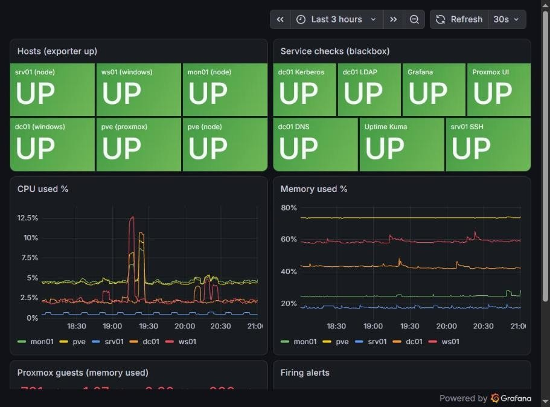

---

## Architecture

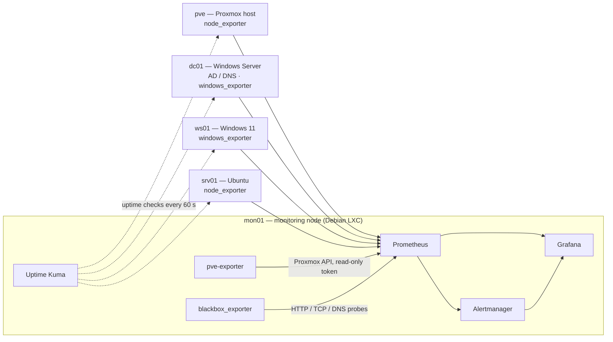

Prometheus pulls metrics from an exporter on each machine every 15 seconds.
Proxmox data comes through its API via `pve-exporter`, and synthetic service
checks run through `blackbox_exporter`. Alerts go to Alertmanager, and Grafana
reads both for its dashboards.

Uptime Kuma runs separately from Prometheus. Prometheus answers "how is each
machine doing?"; Uptime Kuma answers "can someone actually reach the service?"
Because it doesn't depend on Prometheus, a Prometheus failure doesn't leave the
lab unmonitored.

---

## What it monitors

Five hosts: the Proxmox host, a Windows Server domain controller (AD and DNS),
a Windows 11 domain client, an Ubuntu server, and the monitoring node itself.

| Component | Role |
| --- | --- |
| **Prometheus** | Scrapes metrics, evaluates alert rules |
| **Alertmanager** | Groups, deduplicates and routes alerts |
| **Grafana** | Dashboards, with Prometheus and Alertmanager as data sources |
| **Uptime Kuma** | Independent uptime checks and a status page |
| **blackbox_exporter** | HTTP, TCP and DNS service probes |
| **pve-exporter** | Proxmox host, guests and storage through the API |
| **node_exporter** | Linux CPU, memory, disk, network |
| **windows_exporter** | Windows metrics; the DC also reports AD and DNS |

Everything central runs on **mon01**, an unprivileged Debian LXC container
(2 vCPU, 2 GB RAM, 16 GB disk, starts on boot). The whole stack uses about
475 MB of RAM.

---

## Security decisions

- **Least-privilege Proxmox access.** A dedicated API user with the read-only
  `PVEAuditor` role and a scoped token: no password login, no write access.
  The token secret lives only in the exporter's config file (mode `640`) and
  was never printed or committed.
- **Exporters firewalled to the collector.** The Windows exporters accept
  connections only from the monitoring node, so host metrics aren't exposed to
  the rest of the network.
- **Key-only access to the monitoring node.** Root login to mon01 is by SSH key
  from the Proxmox host only; there is no password login.

---

## Dashboards

| Dashboard | Source | Shows |
| --- | --- | --- |
| **Lab Overview** | Built for this lab | Up/down tiles for every host and service check; Linux and Windows CPU and memory on one graph; memory per Proxmox guest; firing alerts |
| Node Exporter Full | grafana.com 1860 | Detailed Linux metrics |
| Proxmox via Prometheus | grafana.com 10347 | Host, VMs, container and storage from the Proxmox API |
| Windows Exporter | grafana.com 20763 (patched, see below) | Windows CPU, memory, disks, network, services |

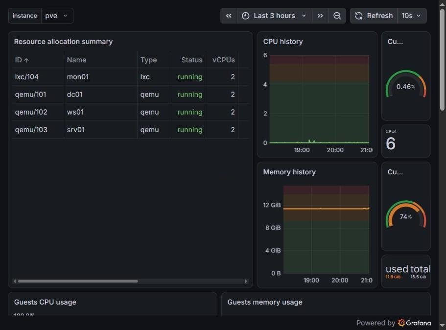

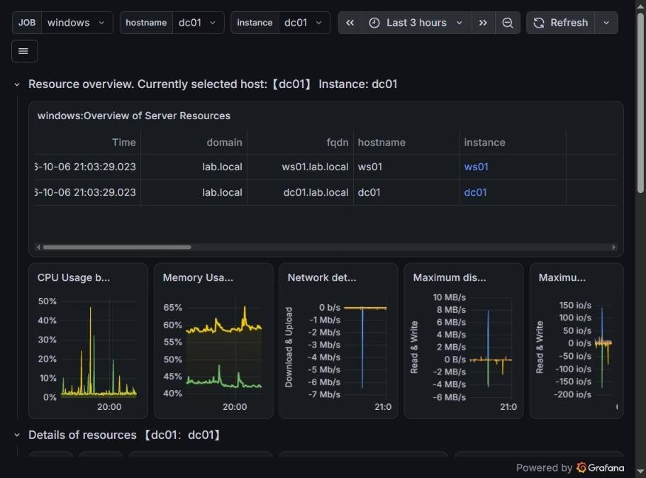

---

## Alerting

8 rules in 2 groups. Alertmanager groups alerts by name and host, and an
inhibit rule suppresses service-check alerts for a host that is already down,
so one outage produces one alert instead of a flood.

| Alert | Fires when | For | Severity |
| --- | --- | --- | --- |
| `TargetDown` | An exporter stops answering | 2 min | critical |
| `ServiceCheckFailed` | A blackbox probe fails (Proxmox UI, Grafana, Uptime Kuma, LDAP, Kerberos, DNS, SSH) | 2 min | critical |
| `DomainControllerServiceStopped` | NTDS, DNS, KDC or Netlogon on the DC is not running | 2 min | critical |
| `LinuxDiskSpaceLow` / `WindowsDiskSpaceLow` | A volume has under 15% free | 5 min | warning |
| `LinuxMemoryHigh` | Memory over 90% | 10 min | warning |
| `LinuxCpuHigh` | CPU over 90% | 10 min | warning |
| `ProxmoxStorageHigh` | A storage pool over 80% full | 10 min | warning |

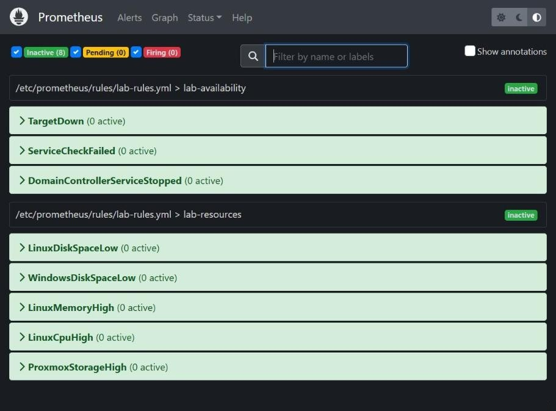

---

## Uptime Kuma: service checks and status page

9 monitors, checked every 60 seconds:

| Monitor | Check |
| --- | --- |
| Proxmox web UI | HTTPS (self-signed certificate accepted) |
| Proxmox host | Ping |
| dc01 DNS | DNS lookup for `lab.local` against the DC |
| dc01 LDAP | TCP 389 |
| dc01 Kerberos | TCP 88 |
| srv01 SSH | TCP 22 |
| ws01 agent | TCP 9182 (windows_exporter) |
| Grafana | HTTP health endpoint |
| Prometheus | HTTP health endpoint |

A status page groups them into Infrastructure, Active Directory, Servers and
endpoints, and Monitoring stack, each with an uptime history bar.

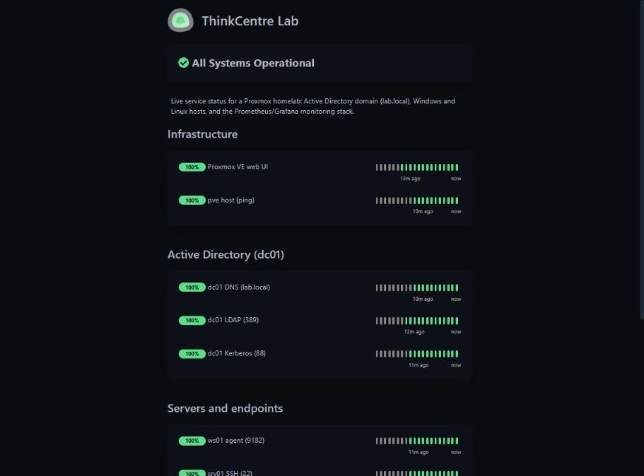

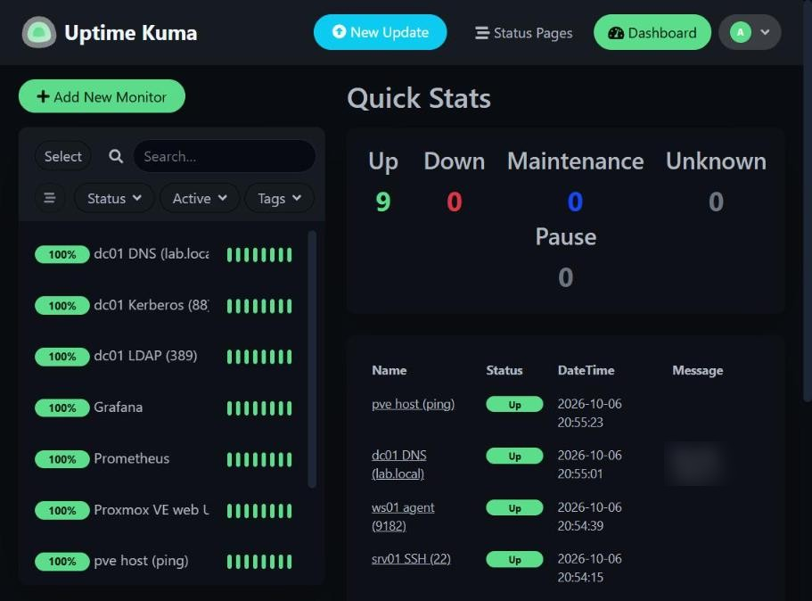

---

## Verification

| Check | Result |
| --- | --- |
| Scrape targets | **15 / 15 up**: node (3), windows (2), proxmox, prometheus, alertmanager, and 7 blackbox targets |
| Blackbox probes | **7 / 7** passing: Proxmox UI, Grafana, Uptime Kuma, LDAP 389, Kerberos 88, DNS, SSH 22 |
| Uptime Kuma | **9 / 9** monitors up |
| Config validation | `promtool check config`: SUCCESS, 8 rules found |
| Grafana health | `/api/health` ok, no provisioning errors |
| **Outage test 1 (Linux)** | Stopped node_exporter on srv01. `TargetDown` was active in Alertmanager when checked under 3 minutes later. After a restart, no alerts were firing 30 seconds later. |
| **Outage test 2 (Windows)** | Stopped windows_exporter on ws01 for 8 minutes. Prometheus fired `TargetDown`, Uptime Kuma marked the ws01 agent down, and the status page switched to Partially Degraded. When the service came back, the alert cleared about 30 seconds later with no manual action. |

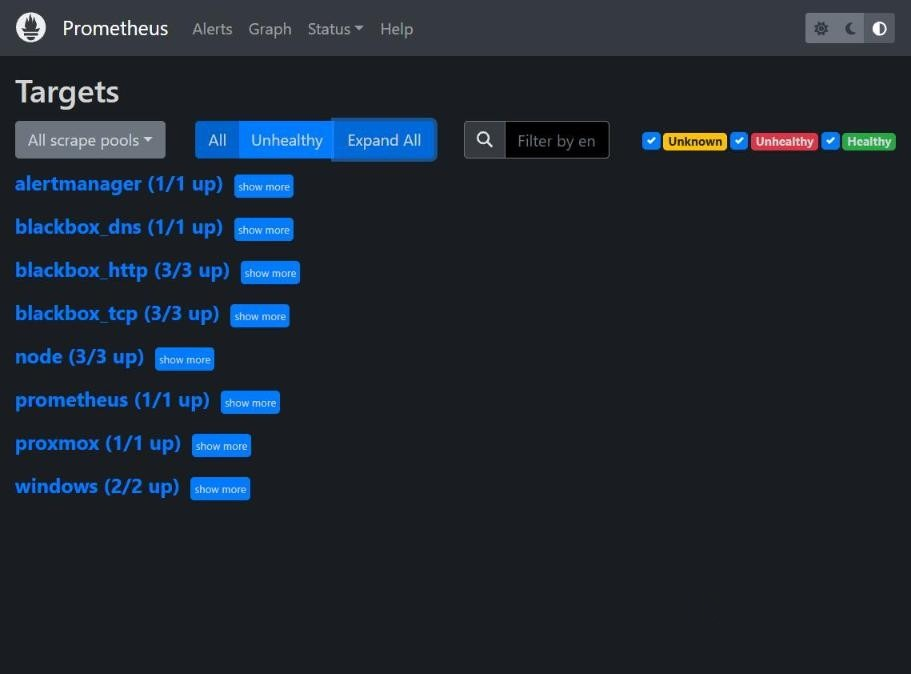

The Windows outage, as each tool saw it:

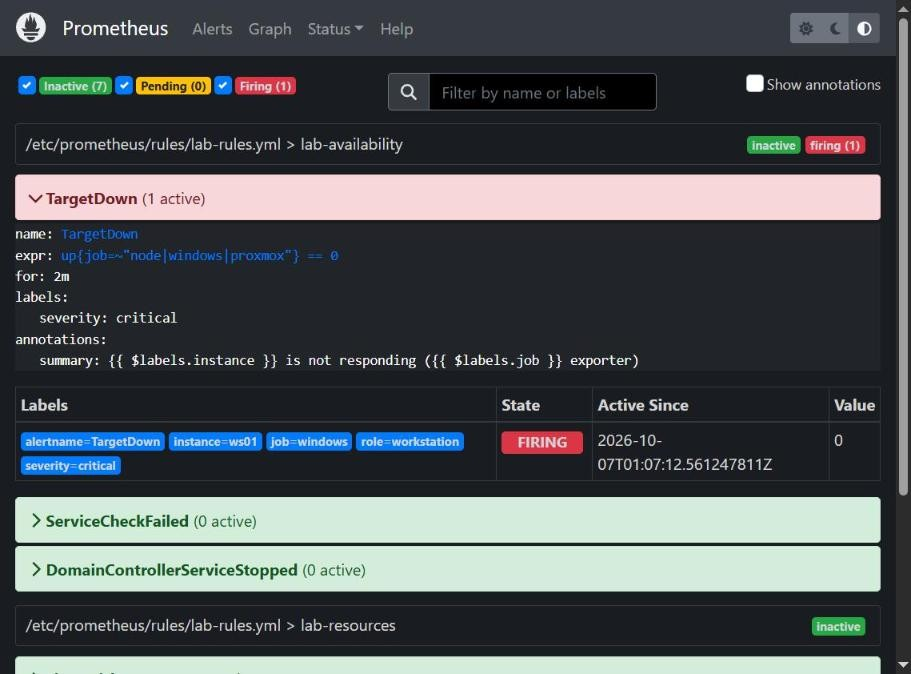

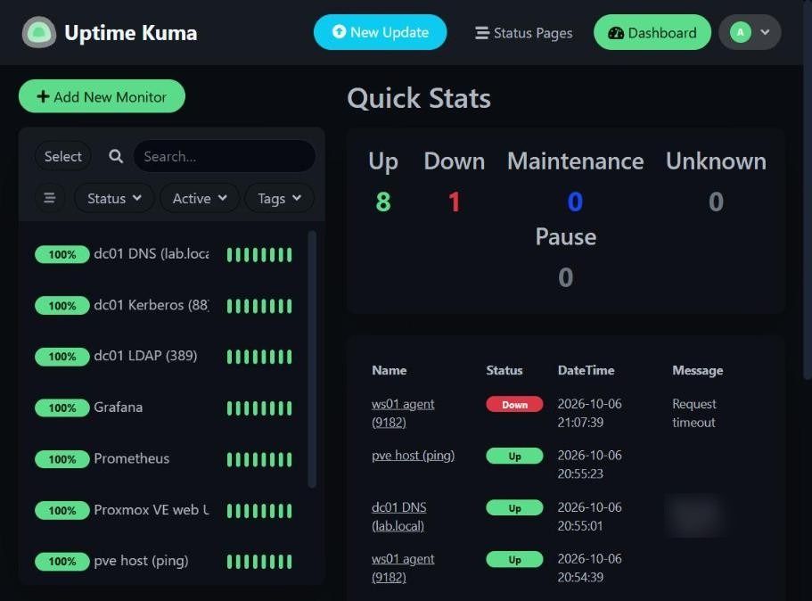

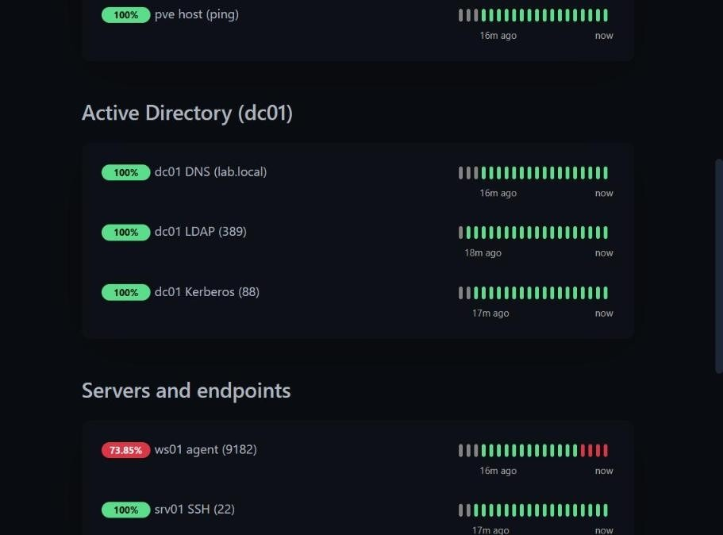

---

## Problems solved along the way

- **A dashboard with no data.** The community Windows dashboard showed nothing
  because windows_exporter v0.31 removed the `windows_cs_*` metrics it queried.
  I updated the dashboard's queries to the current metric names.
- **A missing web UI.** The Debian Prometheus package ships without its web
  interface, so I installed it with the package's bundled `install-ui.sh`.

---

## Next steps

- **Push notifications:** route Alertmanager and Uptime Kuma to a Discord
  webhook so alerts reach a phone. The receiver is already written and only
  needs the webhook URL.
- **Log aggregation:** add Loki and Promtail so Windows event logs and Linux
  syslog sit next to the metrics in Grafana.
- **Watching the watcher:** add an external heartbeat (a "dead man's switch"
  alert) so a failure of the monitoring node itself gets noticed.

---

## Stack

`Prometheus` · `Grafana` · `Alertmanager` · `Uptime Kuma` · `node_exporter` ·
`windows_exporter` · `blackbox_exporter` · `Proxmox VE` · `Debian` · `LXC`
