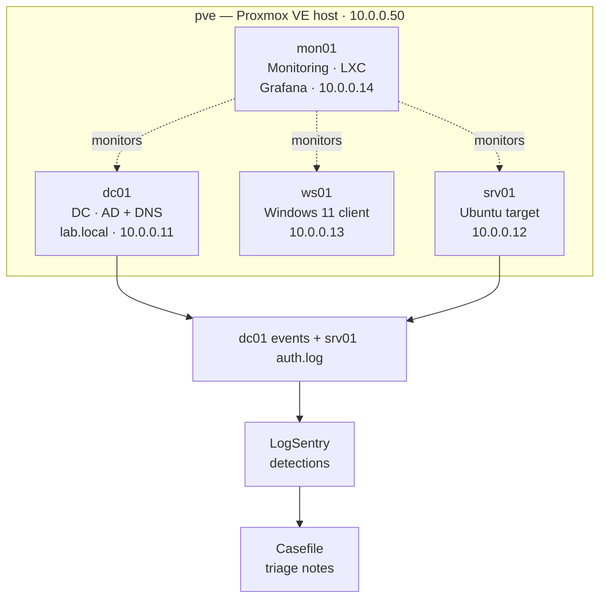

# ThinkCentre Security Lab

A self-contained security lab built on a single refurbished ThinkCentre: a Windows Active Directory domain, a Linux server, a Windows client, a detection pipeline, and system hardening — all on one small machine.

## Overview

I built this security lab to practice the full loop a defender works in: stand up a realistic Windows and Linux environment, generate and collect security telemetry, detect and triage suspicious activity, and harden the systems against a measured baseline. The whole thing runs on a single refurbished ThinkCentre (16 GB of RAM) under the Proxmox hypervisor, so an Active Directory domain, a Linux server, a Windows client and a monitoring stack all live on one small machine I can tear down and rebuild from scratch.

I installed and configured every part of this myself, so I understand how each piece fits together: the operating systems, the Active Directory domain, the detection pipeline, and the monitoring.

## The environment

Every machine sits on an isolated 10.0.0.0/24 network, with the domain controller providing DNS for the lab.local domain.

| Host | Role | OS | Resources | Address |
|---|---|---|---|---|
| pve | Proxmox VE hypervisor (the host) | Proxmox VE 9 (Debian) | 16 GB / ~220 GB | 10.0.0.50 |
| dc01 | Active Directory domain controller (AD DS + DNS) | Windows Server 2025 | 4 GB / 60 GB | 10.0.0.11 |
| ws01 | Domain-joined Windows client | Windows 11 Enterprise | 4 GB / 50 GB | 10.0.0.13 |
| srv01 | Linux server and hardening target | Ubuntu Server 24.04 LTS | 2 GB / 25 GB | 10.0.0.12 |
| mon01 | Monitoring node (LXC container) | Debian 13 | 2 GB / 16 GB | 10.0.0.14 |

Every guest is UEFI, uses VirtIO devices for performance, and has clean snapshots so I can reset to a known-good state at any time.

## Architecture

The domain controller anchors identity and DNS for lab.local. The Windows client and Linux server are the endpoints that generate activity, and a detection pipeline on the host collects their logs, runs detections, and produces analyst-style triage notes. A separate monitoring container watches the health of every machine.

## How I built it

### 1. Hypervisor and VMs

I installed Proxmox VE on the ThinkCentre, set up its package repositories, and created each VM with consistent sizing, UEFI firmware, and VirtIO storage and networking. I installed Windows Server, Windows 11 and Ubuntu on the three guests, loaded the VirtIO storage and network drivers during the Windows installs, and installed the guest tools afterwards.

### 2. Active Directory domain

On dc01 I promoted a new forest, lab.local, running AD DS and DNS, and turned off DHCP so addressing stays static and predictable. I then built out the directory itself: organizational units, user and service accounts, and security groups. I joined the Windows 11 client to the domain with an offline domain join, so the machine account was created on the controller and consumed on the client without any domain credentials crossing the network.

### 3. Audit policy for detection

A domain is only useful for detection if it logs the right things. I configured an advanced audit policy through Group Policy to capture logon events, account and group management, credential validation, and — importantly — process creation with full command lines. The command-line logging is the piece that makes process activity readable after the fact.

### 4. Linux server

srv01 is an Ubuntu server that acts as a second telemetry source and as a hardening target. It runs auditd and rsyslog for logging, with SSH restricted to a dedicated group and key-based authentication. Its authentication logs feed the same detection pipeline as the Windows events.

### 5. Detection pipeline

The core of the lab is a pipeline that runs on the host each cycle. It collects dc01's Security event log and srv01's auth log, runs them through a detection engine that flags suspicious patterns, and writes structured triage notes with a small case-management tool. Nothing gets flagged without the events behind it, so every note points back at what set it off.

### 6. Monitoring

A lightweight monitoring stack — Prometheus, Grafana, Alertmanager and Uptime Kuma, in a dedicated container — watches CPU, memory, disk, service health and uptime across all five machines, with alerting rules and a status page. It has [its own writeup](README.md).

## Detection results

With auditing in place, the first full pipeline run over the domain's Security log processed roughly 1,960 Windows events and raised **40 alerts** (1 critical, 33 high, 6 low). Most were the account creations and group-membership changes from building the directory itself, which is the kind of identity activity you'd want flagged in production. All 40 came back with triage notes grounded in their source events, and none were withheld for lack of evidence.

The same pipeline can be pointed at simulated attack activity (failed-logon bursts, password spraying, a rogue admin account) to push the detections harder.

## Hardening

I audited srv01 against a CIS-style baseline, hardened it, and re-measured. The posture score went from **71% (grade D)** to **95% (grade A)**.

| Area | Before | After |
|---|---|---|
| Overall score | 71% (grade D), 245/344 | 95% (grade A), 328/344 |
| SSH | 52% | 100% |
| Network | 53% | 100% |
| Logging | 62% | 100% |
| Accounts | 87% | 100% |
| Checks failing | 12 | 1 |

The changes, each mapped to its CIS and NIST control:

- **SSH:** key-only authentication, weak ciphers and protocol 1 removed, an idle-session timeout, a lower MaxAuthTries, and corrected sshd_config ownership and permissions.
- **Network:** a host firewall (ufw), ICMP-redirect rejection, and reverse-path filtering.
- **Logging:** auditd watches on the identity files (passwd, shadow, group, sudoers) and log retention.
- **Accounts:** enforced password age and length policies.

I scoped the firewall so the lab keeps working: SSH only from the lab subnet, and the metrics port only from the monitoring host. After applying everything I checked that remote administration and the monitoring scrape still worked. Two findings I left open on purpose: the monitoring and SSH services have to listen on the network (the firewall now controls who can reach them), and I didn't split /tmp onto its own mount, which would be more disruptive than it's worth on a lab box.

## Problems I had to solve

A few things that didn't just work the first time:

- **Windows installs on VirtIO.** Windows setup couldn't see the virtual disk or network card until I supplied the VirtIO drivers during setup. Once I loaded the storage and network drivers at the right point and installed the guest tools after first boot, both Windows machines installed cleanly.
- **An audit policy that silently didn't apply.** Process-creation auditing wasn't taking effect. I traced it to two causes: a malformed auditpol CSV (a field-count mismatch that Windows rejected outright) and a Group Policy version increment that bumped the user half of the version number instead of the computer half, so clients never re-applied the computer policy. Fixing both got command-line process auditing working.
- **A domain join with no credentials on the wire.** Using offline domain join, the machine account was created on the controller and consumed on the client without sending a domain password across the network.
- **Hardening without locking myself out.** Turning on a host firewall with a default-deny policy would have cut off SSH and the metrics port if I hadn't allowed them first. I added scoped allow rules before enabling it and checked connectivity straight after.

## Possible next steps

- Add centralized log shipping (Loki/Promtail or a SIEM) so Windows and Linux logs sit alongside the metrics.
- Run scripted attack simulations on a schedule to exercise the detections continuously.
- Extend hardening to the Windows hosts with a CIS benchmark and track the delta over time.
